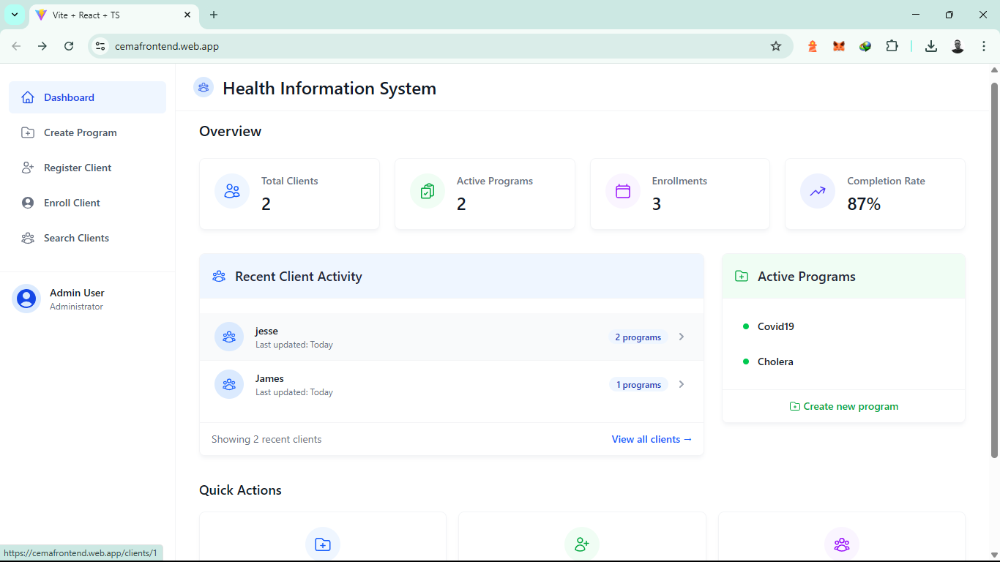

# Health Information System Frontend

A modern React frontend for the Health Information System, built with Vite, TypeScript, and TailwindCSS.

## Dashboard Preview



## Features

- Dashboard with quick access to key functions
- Create and manage health programs
- Register and manage clients
- Search clients by name
- View detailed client profiles
- Enroll clients in health programs
- Modern, responsive UI with Tailwind CSS
- Form validation with Yup
- API integration with Axios

## Tech Stack

- React 18
- TypeScript
- Vite
- TailwindCSS
- React Router DOM
- Formik + Yup
- Axios
- Heroicons

## Setup

1. Install dependencies:
   ```bash
   npm install
   ```

2. Create a `.env` file:
   ```
   VITE_API_BASE_URL=http://localhost:8000/api/v1
   ```

3. Start the development server:
   ```bash
   npm run dev
   ```

## Project Structure

```
src/
├── components/        # Reusable UI components
│   ├── Card.tsx
│   ├── Form.tsx
│   └── Layout.tsx
├── pages/            # Page components
│   ├── Dashboard.tsx
│   ├── CreateProgram.tsx
│   ├── RegisterClient.tsx
│   ├── SearchClients.tsx
│   └── ClientProfile.tsx
├── services/         # API services
│   └── api.ts
├── App.tsx          # Main app component
├── main.tsx         # Entry point
└── index.css        # Global styles
```

## Development

- Run development server: `npm run dev`
- Build for production: `npm run build`
- Preview production build: `npm run preview`

## API Integration

The frontend integrates with the FastAPI backend using Axios. All API calls are centralized in `src/services/api.ts`.

## Styling

The project uses TailwindCSS for styling. The configuration can be found in `tailwind.config.js`.

## Forms

Forms are built using Formik with Yup validation. See the `Form` component for the reusable form structure.